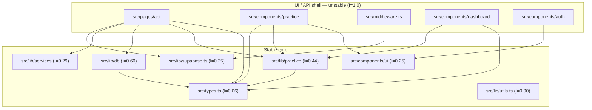

# Repository Map — CloudExamMatter

_Generated 2026-07-03 from three signals: git territory (`artifact-1-territory.md`),
dependency structure (`artifact-2-structure.md`), and authorship
(`artifact-3-contributors.md`). Method: 10xDevs M4L2 "Wide Scan"._

## 1. TL;DR

CloudExamMatter is an Astro 6 + React 19 + Supabase + Cloudflare Workers app that
generates on-demand cloud-certification practice questions (AWS/Azure/GCP) via
OpenRouter, grades them with explanation-first feedback, and tracks per-exam score
trends. It's 2.5 weeks old, ~46 commits, one author, no legacy debt yet — the "map" is
less about untangling history and more about establishing the baseline before it
accumulates any. The architecture is clean: a thin, unstable UI/API shell (pages,
components, middleware) sits on top of a stable core (`types.ts`, `lib/services`,
`lib/db`, `supabase.ts`) with zero circular dependencies. The one real fragility is
`src/types.ts` — 15 modules depend on it and it depends on almost nothing, so it's the
highest-blast-radius file in the repo.

## 2. Teren (Territory)

The practice-generation flow (`PracticeGenerator.tsx`, `types.ts`,
`question-generator.ts`/`.test.ts`) is the hottest code — it's the spine of the
product and the roadmap slice most iterated on. `.github/workflows/ci.yml` is the
second-most-churned file (7 commits): the CI/CD pipeline has been actively engineered
alongside the product, not bolted on once. Work happens in roadmap-slice-sized
commits (6–15 files per phase), matching the `context/changes/<id>/plan.md`
convention, in bursty daytime sessions (peak 15:00–16:00). Co-change stays inside
each vertical slice (session logic, dashboard, question-generation) — no evidence of
tangled, cross-feature commits. Full detail: `artifact-1-territory.md`.

## 3. Realne powiązania (Real structure)

Zero cycles across 55 modules. The instability gradient is textbook: leaves (pages,
components, middleware, I=1.0) depend inward on a stable core (I≈0–0.6), never the
reverse. `src/types.ts` is the shared kernel — Ca=15, the single highest-leverage (and
highest-risk) file to change. Full metrics table: `artifact-2-structure.md`.

## 4. Strefy ryzyka (Risk zones)

| Zone | Why it's risky | What to do about it |
|---|---|---|
| `src/types.ts` | Ca=15 — 15 other modules import it directly. A breaking shape change ripples across UI, API, and lib layers simultaneously with no compiler-independent safety net beyond TS itself. | Any refactor touching shared types needs a full `tsc`/test/build pass before merge, not a spot-check. Candidate for the M4L4 refactor-opportunities pass if it keeps growing. |
| `.github/workflows/ci.yml` | Second-highest churn (7 commits) and has twice co-changed with `wrangler.jsonc`/`Layout.astro` in the same commit — a sign CI edits occasionally piggyback unrelated changes. | Keep CI changes in their own commits; watch for scope creep here specifically. |
| `src/lib/db` | Leans unstable (I=0.60) while sitting in the "core" layer — it depends on generated `database.types.ts`, so schema drift in Supabase surfaces here first. | Regenerate `database.types.ts` as a checked step whenever the Supabase schema changes; don't hand-edit it. |
| Single-author bus factor | 46/46 commits by one person; no second reviewer has touched the code. | Not a defect at this stage, but the certification report and `context/changes/` trail are the only substitute for a second pair of eyes — keep them current. |

## 5. Kogo zapytać (Who to ask)

Single-contributor repo — there's no per-module owner to route questions to. Instead:

- **Practice-generation flow** → read `context/changes/question-generation-engine/`
  and `context/changes/generate-first-practice-set/` (change.md + research.md + plan.md).
- **Session/progress/dashboard** → `context/changes/session-persistence-history/`,
  `context/changes/progress-dashboard/`, `context/changes/retry-weak-topics/`.
- **CI/CD and deploy decisions** → `context/foundation/infrastructure.md` plus the
  commit trail on `.github/workflows/ci.yml`.
- **Product intent and scope** → `context/foundation/prd.md` and `roadmap.md`.

This is the answer this lesson step normally gives as a person; here it's a folder.
See `artifact-3-contributors.md` for the full reasoning.

## 6. Pierwszy dzień (First day)

1. Read `README.md`, then `context/foundation/prd.md` for product intent.
2. Read this map, then skim one full slice end-to-end in
   `context/changes/generate-first-practice-set/` (change → research → plan) to see
   the working convention in practice.
3. `npm install`, copy `.env.example` → `.dev.vars`, get a Supabase project +
   OpenRouter key, `npm run dev`.
4. Run `npm run lint && npm run test` before touching anything, to see a green
   baseline.
5. Before editing `src/types.ts`, re-read the risk-zone note above — check what
   imports it (`npx depcruise src --config .dependency-cruiser.cjs` if the graph may
   have shifted) before assuming a shape change is local.

## 7. Ograniczenia (Limitations)

- **2.5 weeks of history is not enough to call any of this "legacy."** Churn,
  co-change, and coupling numbers are directional, not statistically stable — re-run
  this map in a few months and expect the picture to sharpen or shift.
- **Single author means the "contributors" signal is structurally thin** — it answers
  "how does this person work" rather than "who owns what," which is what the lesson
  template assumes for a multi-author legacy repo.
- **Dependency graph covers `src/` only** — it does not trace into `supabase/`
  migrations, GitHub Actions composite steps, or the `.claude/skills/` toolkit, all of
  which are real coupling surfaces (e.g. `db/database.types.ts` is generated from a
  Supabase schema this graph doesn't see).
- **No production incident history exists yet** to validate which risk zones are real
  versus theoretical — the risk-zone table above is inferred from structure, not from
  "this broke twice" evidence.
